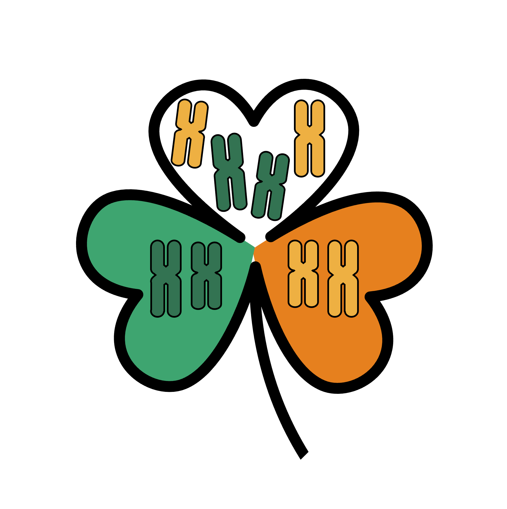
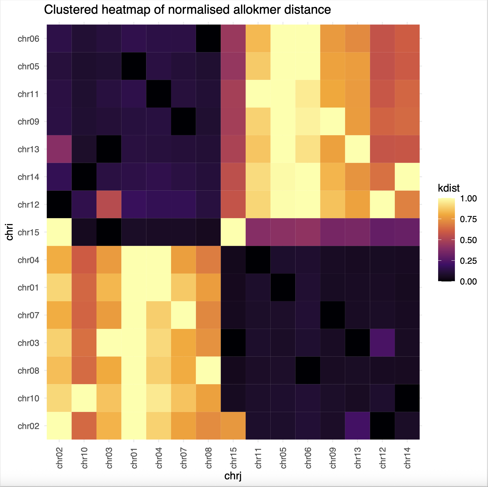

# SHAMROCK: Separating Homeologue Ancestors by Mapping Repeats with Overlapping Common Kmers

kmer-based separation of allotetraploid parental subgenomes. This readme was written for `v0.3.0`.

* [Introduction](#Introduction)
* [Installation and setup](#installation-and-setup)
* [Running SHAMROCK](#running-shamrock)
* [How it works](#how-it-works)
* [Examples](#Examples)
* [Citation](#Citation)
* [Future Plans](#future-plans)


## Introduction

SHAMROCK is a kmer-based tool for disentangling homeologous chromosomes in allotetraploid genomes by subtracting shared sequence content, 
identifying "allokmers" unique to each homoelogue, and clustering chromosomes into subgenomes based on shared allokmer content.


## Installation and setup

To run SHAMROCK, you will need to have [KMC](https://github.com/refresh-bio/KMC) and R installed.
R will need the `tidyverse` and `r-markdown` libraries. For default settings, [compleasm](https://github.com/huangnengCSU/compleasm)
should also be installed on the system.

These can be set up easily in a conda environment.

```
conda create -n shamrock
conda activate shamrock
mamba install -c conda-forge -c bioconda kmc r-base r-tidyverse r-rmarkdown compleasm
```

(If you don't use `mamba`, then replace the last command with `conda`.)

To run the examples, or to use [Telociraptor](https://github.com/slimsuite/telociraptor) for formatting input, you will also want to have
python3 on your system, and clone the [Telociraptor](https://github.com/slimsuite/telociraptor) repo next to the 
[SHAMROCK](https://github.com/slimsuite/shamrock) repo.

```
├── shamrock/
└── telociraptor/
```

For example, to set up and run in the directory `~/code`:

```
cd ~/code/
git clone https://github.com/slimsuite/shamrock
git clone https://github.com/slimsuite/telociraptor

# Test run
~/code/shamrock.sh
python3 ~/code/telociraptor/code/telociraptor.sh --help
```

## Running SHAMROCK

SHAMROCK is designed to run as a simple shell script on an input assembly in fasta format:

```
./shamrock/shamrock.sh <FASTA>
```

### Input format

The assembly should be in fasta format with a **single line per sequence** and the names of chromosomes starting `chrXX`,
where `XX` is a number from `01` to `N`. [Telociraptor](https://github.com/slimsuite/telociraptor) can be used to generate this format 
(see `get_examples.sh` and `chromformat.sh`).

```
>chr01 OX638062 ENA|OX638062|OX638062.1 Trifolium dubium genome assembly, chromosome: 1
CCCTAAACCCTAAACCCTAAACCCTAAACCCTAAACCCTAAACCCTAAACCCTAAACCCT...
>chr02 OX638063 ENA|OX638063|OX638063.1 Trifolium dubium genome assembly, chromosome: 2
GTGAGTGTGTTTTATAGAATTAGTTTGGATAAACTTTTGAGCAAACACACCAAAAGAAAA...
>chr03 OX638064 ENA|OX638064|OX638064.1 Trifolium dubium genome assembly, chromosome: 3
TAAACCCTAAACCCTAAACCCTAAACCCTAAACCCTAAACCCTAAACCCTAAACCCTAAA...
>chr04 OX638065 ENA|OX638065|OX638065.1 Trifolium dubium genome assembly, chromosome: 4
ACCCTAAACCCTAAACCCTAAACCCTAAACCCTAAACCCCTAAACCCTAAACCCTAAACC...
...
```

**NOTE:** This needs a bit of work, and is currently limited to assemblies with 10-99 chromosomes, as it assumes a two digit counter.
For assemblies with fewer than 10 chromosomes, rename sequences using `sed -i s/>chr/>chr0/ $SEQIN`. 
For 100 or more chromosomes, edit the `shamrock.sh` file to have `chr%03d` in place of `chr%02d`.

**NOTE:** Telociraptor identifies chromosomes based on a minimum length criterion - 10 Mbp by default.
This can be altered with the `minchrom=INT` setting.

If you have a species that has data in ENA with a BioProject ID and chromosomes named and numbered (`chromosome: X`) in the description,
you can use the `chromformat.sh` script to download and reformat the data:

```
chromformat.sh <GENBASE> <BIOPROJECT>
```

For example, for the shamrock:

```
~/code/shamrock/chromformat.sh drTriDubi3 PRJEB62713
```

For other species, some additional formatting may be required. 
For example, the Clover Daisy example does not have named chromosomes and needs some of the contigs renamed prior to running `chromformat.sh`.
Note that the BioProject is not neeed in this instance as the fasta file already exists.
(This script needs the input file to be named `$GENBASE.fasta`.)

```
wget "ftp://ftp.ebi.ac.uk/pub/databases/ena/wgs/public/cam/CAMTDV01.fasta.gz"
unpigz -v CAMTDV01.fasta.gz
sed 's/contg: chr_/chromosome: /' CAMTDV01.fasta > ScaAtr.fasta 
~/code/shamrock/chromformat.sh ScaAtr
```

### Primary outputs

The main outputs are a PDF of the clustering, along with two fasta files representing the parental partitioning.

### Controlling SHAMROCK runs

SHAMROCK can be run with an optional `<RUNMODE>` after the input fasta file:

```
./shamrock/shamrock.sh <FASTA> <RUNMODE>
```

By default, `$RUNMODE` is "completion". 
If `$RUNMODE` is set to "next" then SHAMROCK will run the next step and then stop.
If `$RUNMODE` is set to one of the stages (see [How it works](#how-it-works)), SHAMROCK
will run to that stage and then stop. If that stage has already run, it will re-run just that stage.
If `$RUNMODE` is set to "force" then it will re-run every stage.

**NOTE:** You can tell whether a stage completed, as it will produce a `$GENBASE.XX-$STAGE.done` file.

For more control of settings, you can also copy the `shamrock.config` file from the repo into your run directory and edit any settings.
These will over-ride any default settings.

### Manual homeologue identification

To over-ride either compleasm or kmer-based homeologue detection, a `$GENBASE.best.txt` file can be provided.
This is a simple space-delimited text file with three fields: `cluster chri chrj`, where `cluster` is an arbitrary integer, 
`chri` is one chromosome, and `chrj` is a homeologue. Relationships will be inverted to form final homeologue sets,
but each chromosome must appear at least once as `chri` or `chrj`, _e.g._

```
3226176 chr01 chr05
4559767 chr02 chr12
3289711 chr03 chr13
...
```


### Known issues and considerations

**Homeologue Pairing.** Pairing of the chromosomes based on maximum shared kmers can go wrong, 
particularly when there has been a lot of rearrangements - or very long chromosomes - where
a same chromosome can be the "best" hit for many other chromosomes. 
Version `v0.3.0` introduced compleasm-based pairing, using the number of shared (`Duplicated`) orthologues.
This appears to be effective but has not been broading tested.
Using HiC-guided manual assignment might also be more effective. 

**Beyond tetraploidy.** SHAMROCK is designed to partition allotetraploids. 
Additional ploidies might be amenable to the same approach. 
To try this, copy the `shamrock.config` file into the run directory and change `BESTN=1`,
_e.g._ for an octoploid you would set `BESTN=3` as each chromosome has three other homeologues.
As of `v0.3.0`, the Rscript has not been updated to partition into more parental sets, but it
might be possible to manually assign subgenomes based on the `*.shamrock.pdf` output.


## How it works

SHAMROCK `v0.3.0+` consists of the following stages:

1. **ChromKMC.** Each chromosome is pulled out into a separate fasta file and KMC is used to generate kmer profiles per chromosome.

2. **ChromIntersect.** Unless the `$BEST` file (see below) has been provided manually, each chromosome will be compared to every other
for either shared Compleasm `Duplicated` genes (`BEST=compleasm`), or kmer intersects (`BEST=kmers`).

3. **PairChrom.** Based on the number of intersecting genes or kmers from the previous step (or a provided `$GENBASE.best.txt` file),
chromosomes will be grouped into homeologous sets. For manual files, all listed chromosome pairs will be considered homeologues.
For kmer- or gene-based clustering, the top `$BESTN` other chromosomes will be included as pairs for each chromosome.  
The full set are then output to `kmc_$GENBASE/$GENBASE.$CHR.alt.fasta` files.
**NOTE 1:** By default, `$BESTN` is set to 1, which represents tetraploidy.
**NOTE 2:** This can go wrong if there has been a lot of rearrangements within the two subgenomes such that chromosomes no longer match.

4. **AlloKmers.** The core element of SHAMROCK is the establishment of "allokmers". 
These are kmers that are unique to one homeologue, _i.e._ not found in its homeologous chromosomes.
Allokmers are identified by subtracting the full set of kmers from the `kmc_$GENBASE/$GENBASE.$CHR.alt.fasta` file generated during **PairChrom**
from the full chromosome kmer complement generated in **ChromKMC**.

5. **AlloKmerIntersect.** Subgenomes are identified by generating pairwise allokmer intersects for all pairs of chromosomes. 
These are used in the **Rscript** step to cluster chromosomes into distinct allokmer distance clusters.

6. **Rscript.** Pairwise shared allokmer counts are converted into a normalised similarity matrix. 
For each chromosome, the maximum non-self allokmer count is set at 100% similarity, and all allokmer counts for that chromosome normalised to a 
proportion of the maximal count. (Self counts are capped at 1.0.) 
Normalised counts are then used to generate a heatmap with `ggplot` `geom_tile()`, with axes arranged according to `hclust` hierarchical clustering of the matrix.
The final subgenomes are established using `cuttree` partitioning of the row clusters.
By default, two subclusters are created. This is controlled by `$BESTN` as with **PairChrom**.
The Rscript can be re-run with different numbers of clusters by over-riding the `partition=INT` settting.

7. **SubGenomes.** The final step will take the subgenome chromosome lists and generate fasta files for each subgenome.


## Examples

Partitioning of the [Shamrock genome](https://pmc.ncbi.nlm.nih.gov/articles/PMC11384199/), _Trifolium dubium_:



Parent 1: chr01, chr02, chr03, chr04, chr07, chr08, chr10.

Parent 2: chr05, chr06, chr09, chr11, chr12, chr13, chr14, chr15.


## Citation

SHAMROCK has not yet been published. In the meantime, please cite this GitHub if you find it useful.

## Future Plans

SHAMROCK is a work in progress. Please post questions/requests as GitHub issues. One likely issue is where part of one chromosome has translocated to another 
chromosome since the ploidy event. A future

### A note on the name

SHAMROCK is a rather contrived acronym, as the inspirational species for its development was the 
[genome of the Irish Shamrock](https://pmc.ncbi.nlm.nih.gov/articles/PMC11384199/), _Trifolium dubium_.
Suggestions for a better expansion of the acronym are welcome!


